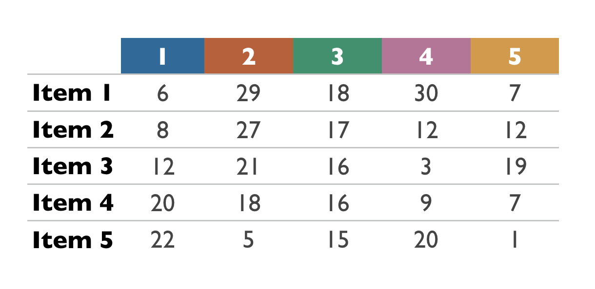

```{r setup, include=FALSE}
knitr::opts_chunk$set(echo = TRUE)

library(tidyverse)
library(viridis)
library(lubridate)

# in case the operating system language is not English (https://stackoverflow.com/questions/17031002/get-weekdays-in-english-in-r)
Sys.setlocale("LC_TIME", "en_US")

# 1. if issues with compiling packages (xcrun: error: invalid active developer path (/Library/Developer/CommandLineTools), missing xcrun at: /Library/Developer/CommandLineTools/usr/bin/xcrun): "xcode-select --install" in Terminal
# 2. Currently unable to install data.tables package due to Mojave issue: clang: error: unsupported option '-fopenmp'
#library(plotly)
```

## NEISS Data

NEISS Data can be downloaded from the NEISS Query Builder. Data files have to be downloaded by year:

[https://www.cpsc.gov/cgibin/NEISSQuery/home.aspx](https://www.cpsc.gov/cgibin/NEISSQuery/home.aspx): Check "Researcher" box for the first question, then download data files and code book as tab-delimited text files.

An R package of the NEISS data is available as well:

[https://github.com/hadley/neiss](https://github.com/hadley/neiss)

Here's an interactive example visualization of NEISS data:

[https://flowingdata.com/2016/02/09/why-people-visit-the-emergency-room/](https://flowingdata.com/2016/02/09/why-people-visit-the-emergency-room/)

### Loading the Data

We will use `read_tsv()` from the `readr` package to load the file.

```{r}
# potential issue in line 160879: additional line break?
neiss <- read_tsv("data/neiss2017.tsv")
```
Let's have a quick look at the tibble to see what we parsed.

```{r}
# column types and preview of values
str(neiss)
```

We can also get a summary of some key statistics.

```{r}
summary(neiss)
```

It turns out that the treatment dates were parsed as character strings. In order to be able to work with dates (e.g. to summarize or group data by month or day), we need to tell the parser that we want to read the `Treatment_Date` column as dates.

```{r}
neiss <- read_tsv("data/neiss2017.tsv", col_types = cols(Treatment_Date = col_date(format="%m/%d/%Y")))
```

```{r}
str(neiss)
```

## Count Cases per Month

```{r}
# https://ro-che.info/articles/2017-02-22-group_by_month_r
cases_month <- neiss %>% group_by(month=floor_date(Treatment_Date, "month"))
                                  
cases_month <- neiss %>% group_by(month=floor_date(Treatment_Date, "month")) %>% summarize(cases=n())

cases_month
stopifnot( sum(cases_month$cases) == dim(neiss)[1] )
```

## Count Cases per Weekday

```{r}
cases_weekday <- neiss %>% group_by(day = weekdays(Treatment_Date)) %>% summarize(cases = n())

cases_weekday
stopifnot( sum(cases_weekday$cases) == dim(neiss)[1] )
```

## Add Additional Columns to Dataset

Because weekday and month might be handy when visualizing the data, we will add two columns to the tibble: `Treatment_Month` and `Treatment_Weekday`.

```{r}
# https://www.packtpub.com/mapt/book/big_data_and_business_intelligence/9781784390815/4/ch04lvl1sec52/adding-new-columns-with-dplyr
neiss <- neiss %>% mutate( Treatment_Weekday=factor(weekdays(Treatment_Date),
        levels=c("Sunday", "Monday", "Tuesday", "Wednesday", "Thursday", "Friday", "Saturday"))) %>% mutate( Treatment_Month = factor(months(Treatment_Date),
        levels=c("January", "February", "March", "April", "May", "June", "July", "August", "September", "October", "November", "December")))
```

## We Need a Mapping for the Codes

Many of the columnn in the tibble use codes that are impossible to interpret without looking them up. NEISS provides a mapping table that we will load now.

```{r}
neiss_codes <- read_tsv("data/neiss_fmt.txt")
```
The `Format name` column indicates the column name in the `neiss` tibble, the `Starting/Ending value for format` entries are the codes, and the `Format value label` are the human readable names for the codes. It seems that in most if not all rows the values for `Starting` and `Ending` values are the same. Let's make sure our assumption about the starting and ending values being identical holds.

```{r}
#stopifnot( neiss_codes[,2] == neiss_codes[,3]  )
which(neiss_codes[,2] != neiss_codes[,3])
```
The second row contains the codes for mapping ages > 2. That's why an actual range is provided. All other rows are just using a single code and not a range.

```{r}
cat("AGELTTWO	2	120	2 YEARS AND OLDER")
```

Since we are not specifically interested in children under two, we will ignore that column for now.

## Mapping Variables using `match`

We will now map the codes for a couple of columns to the `neiss` tibble to get data that doesn't require a lookup table. Let's start with the `Body Part` column. First, we filter the tibble for rows containing codes related to body parts.

```{r}
# first we filter the body part rows from the code table
body_part_codes <- neiss_codes %>% filter(`Format name`=="BDYPT")
body_part_codes 
```

Next, we remove columns that we won't need.

```{r}
body_part_codes <- body_part_codes %>% select(`Starting value for format`,`Format value label`)
body_part_codes
```

Then, we rename columns to make it possible to use their names without backquotes.

```{r}
body_part_codes <- body_part_codes %>% rename(Code=`Starting value for format`)  %>% rename(Label=`Format value label`)
body_part_codes
```

Finally, we convert the `Label` column in to a factor.
```{r}
body_part_codes <- body_part_codes %>% mutate(Label=factor(Label))
body_part_codes
```

Using this clean code table and the `match` function, we will create a new column in the `neiss` tibble.

```{r}
body_part_code_mapping <- match(neiss$Body_Part, body_part_codes$Code)
neiss <- neiss %>% mutate(Body_Part_Label=body_part_codes[body_part_code_mapping,]$Label)
```

Since the label still includes the code value, we will redo this step and trim the code numbers using the `sub`(stitute) command.

```{r}
body_part_code_mapping <- match(neiss$Body_Part, body_part_codes$Code)
neiss <- neiss %>% mutate(Body_Part_Label=sub(".* - ", "", factor(body_part_codes[body_part_code_mapping,]$Label)))

# see ?regex for examples of patterns
# Note that we have to explicitly tell R that we want a factor !
```

Let's repeat this for products and gender (leaving out a few steps that were included for illustration above).

```{r}
codes <- neiss_codes %>% filter(`Format name`=="PROD")
codes <- codes %>% rename(Code=`Starting value for format`)  %>% rename(Label=`Format value label`)
code_mapping <- match(neiss$Product_1, codes$Code)
neiss <- neiss %>% mutate(Product_1_Label=sub(".* - ", "", factor(codes[code_mapping,]$Label)))
code_mapping <- match(neiss$Product_2, codes$Code)
neiss <- neiss %>% mutate(Product_2_Label=sub(".* - ", "", factor(codes[code_mapping,]$Label)))

codes <- neiss_codes %>% filter(`Format name`=="GENDER")
codes <- codes %>% rename(Code=`Starting value for format`) %>% rename(Label=`Format value label`)
code_mapping <- match(neiss$Sex, codes$Code)
neiss <- neiss %>% mutate(Sex_Label=sub(".* - ", "", factor(codes[code_mapping,]$Label)))

```

Because it would be painful to repeat these steps manually for every variable that we want to map, we will create a function that will do that for us. The only parameters that we need in addition to the data and code tibbles are the name of the code table column, the name of the `neiss` column, and the name of the new column to be added to the `neiss` tibble.

```{r}
map_codes <- function( data_tibble, code_tibble, data_column_name, new_data_column_name, code_column_key ) {
  # data_column_name = variable name (e.g. "Body_Part")
  # new_data_column_name = variable name (e.g. "Body_Part_Label")  
  # code_column_key = code table first column value (e.g. "BDYPT")
  
  # ... This will be on your homework assignment
  
  return( data_tibble )
}

# map_codes( neiss, neiss_codes, "Location", "Location_Label", "LOC" )
```

## Save the Tibble for Future Use

Since we don't want to re-run the data cleaning steps every time we want to work with our NEISS data tibble, we will store it in a file that we can easily reload.
```{r}
save(neiss, neiss_codes,file="data/neiss.Rdata")
```

## Let's Make a Plot

```{r}
g <- ggplot(neiss, aes(Treatment_Month)) + geom_bar()
g
```

## Applying a Filter before Plotting
```{r}
g <- ggplot(filter(neiss, Age < 20), aes(Treatment_Month)) + geom_bar(aes(fill=Sex_Label))
g
```

Here is the same plot with facets.

```{r}
g <- ggplot(filter(neiss, Age < 20), aes(Treatment_Month)) + geom_bar(aes(fill=Sex_Label)) + facet_grid(rows=vars(Sex_Label))
g
```

## In-Class Group Exercise

1. Go to the NEISS website: [https://www.cpsc.gov/Research--Statistics/NEISS-Injury-Data](https://www.cpsc.gov/Research--Statistics/NEISS-Injury-Data)
1. Find the code book: [https://www.cpsc.gov/s3fs-public/2017NEISSCodingManualCPSConlyNontrauma.pdf](https://www.cpsc.gov/s3fs-public/2017NEISSCodingManualCPSConlyNontrauma.pdf)
1. Look up some product codes that you find interesting (e.g. 1313 - Fireworks, 5040 - Bicycles)
1. Create a ggplot that shows the distribution of injuries caused by those products by month
1. Create a ggplot that shows the distribution of injuries caused by those products by weekday
1. Stratify those distributions by sex

### Plot showing the distribution of injuries caused by Fireworks and Bicycles by Month and Sex

```{r}
g <- ggplot(filter(neiss, Product_1==1313 | Product_1==5040), aes(Treatment_Month)) + geom_bar(aes(fill=Sex_Label)) + facet_grid(rows=vars(Product_1_Label))
g
```

### Plot showing the distribution of injuries caused by Fireworks and Bicycles by Weekday and Sex

```{r}
g <- ggplot(filter(neiss, Product_1==1313 | Product_1==5040), aes(Treatment_Weekday)) + geom_bar(aes(fill=Sex_Label)) + facet_grid(cols= vars(Product_1_Label))
g
```

We can also rotate the plot by 90 degrees using `coord_flip`. Adding `x=forcats::fct_rev(Treatment_Weekday)` to the aesthetic of the bar geometry will reverse the order (otherwise the weekdays are listed in reverse chronological order).

```{r}
g <- ggplot(filter(neiss, Product_1==1313 | Product_1==5040), aes(Treatment_Weekday)) + geom_bar(aes(fill=Sex_Label, x=forcats::fct_rev(Treatment_Weekday))) + facet_grid(cols= vars(Product_1_Label)) + coord_flip()
g
```

## A couple more ``ggplot`` examples

## A Simple Data Table

Here is a very simple data table that was used to create the barcharts in _[Streit & Gehlenborg (Nature Methods, 2014)](https://www.nature.com/nmeth/journal/v11/n2/full/nmeth.2807.html)_ ([PDF](materials/streit-and-gehlenborg_nature-methods_2014.pdf)).

```{r, out.width = "90%", echo=FALSE}

```

Let's create a tibble containing this data.

```{r}
items <- tribble(
~item, ~category1, ~category2, ~category3, ~category4, ~category5,
"item1",	6,	29,	18,	30,	7,
"item2",	8,	27,	17,	12,	12,
"item3",	12,	21,	16,	3,	19,
"item4",	20,	18,	16,	9,	7,
"item5",	22,	5,	15,	20,	1  
)
items
```

And now we are ready to plot! Let's plot the data for `category1` across all items.

```{r}
ggplot(data = items) + geom_bar(mapping = aes(x=item, y=category1), stat="identity")
```

What happened? First of all, __our tibble is not tidy!__ How do we make it tidy? 

```{r}
items <- items %>% gather(`category1`,`category2`,`category3`,`category4`,`category5`,key="category",value="value")
items
```

Now we have a tidy tibble that we can use to create a lot of fancy visualizations. But let's try to reproduce our previous plot first.

```{r}
gg <- ggplot(data = items) + geom_bar(mapping = aes(x=item, y=value), stat="identity")
gg
```

This looks different! Maybe this is not surprising, because we didn't specify that we want to plot `category1`. But what did we get instead? Let's use an additional aesthetic to include information about the categories. We will use the `fill` aesthetic, which maps a color to each value of a variable. Here we are using the `category` variable.

```{r}
gg <- ggplot(data=items) + geom_bar(mapping=aes(x=item, y=value, fill=category), stat="identity")
gg
```

We created a stacked bar chart. When we compare the order of the categories in the stacks, we find that they are the reverse of the categories in the figure in the Nature Methods column. We will fix this using a factor operation on the `category` variable.

```{r}
gg <- ggplot(data = items) + geom_bar(mapping = aes(x=item, y=value, fill=forcats::fct_rev(category)), stat="identity")
gg
```

This fixes the order of the categories in the stack but the title of the legend is messed up. `ggplot` allows you to fix the label but we won't cover this now. 

The next step is to rotate the plot by 90 degrees. We simply add that rotation to the existing plot using the `coord_flip` operation.

```{r}
gg <- gg + coord_flip()
gg
```

## Filters

Sometimes we don't want to plot all the data in our data set. The `tidyverse` offers the handy `filter` function (in the `dplyr` package). We will remove all data but data associated with `category1`.

```{r}
gg <- ggplot(data=filter(items,category=="category1")) + geom_bar(mapping=aes(x=item, y=value, fill=forcats::fct_rev(category)), stat="identity") + coord_flip()
gg
```

What if we want to view data for both `category1` and `category2`?

```{r}
gg <- ggplot(data=filter(items,category=="category1" & category=="category2" )) + geom_bar(mapping=aes(x=item, y=value, fill=forcats::fct_rev(category)), stat="identity") + coord_flip()
gg
```

So why does that not work? `filter` operates on the rows of the `items` tibble and since there is no row that contains __both__ `category1` __and__ `category2`, the result of the `filter` operation is empty. The correct approach to get data for `category1` and `category2` is to use a logical OR ("|") operator. 

```{r}
gg <- ggplot(data=filter(items, category=="category1" | category=="category2" )) + geom_bar(mapping=aes(x=item, y=value, fill=forcats::fct_rev(category)), stat="identity") + coord_flip()
gg
```

We can also filter for items at the same time.

```{r}
gg <- ggplot(data=filter(items, (item=="item1" | item=="item3" | item=="item5") & (category=="category1" | category=="category2") )) + geom_bar(mapping=aes(x=item, y=value, fill=forcats::fct_rev(category)), stat="identity") + coord_flip()
gg
```

## Creating a Layered Bar Chart

To create the layered bar chart, we need to split the items into one barchart per category. To achieve this, we use the `category` variable to facet the data.

```{r}
gg <- ggplot(data=items) + geom_bar(mapping=aes(x=item, y=value, fill=forcats::fct_rev(category)), stat="identity") + coord_flip()
gg <- gg + facet_wrap(~category)
gg
```
 
By default, the faceted plots will be arranged to use the available space. However, the number of rows and columns can be set explicitly as well.
 
```{r}
gg <- ggplot(data=items) + geom_bar(mapping=aes(x=item, y=value, fill=forcats::fct_rev(category)), stat="identity") + coord_flip()
gg <- gg + facet_wrap(~category, ncol=5, nrow=1)
gg
```

This looks a bit ugly with the default plot width and aspect ratio. We can fix this by providing explict plot dimensions or an aspect ratio. __Note__: This is an R Markdown feature. How would you do this outside of R Markdown?

```{r, fig.width = 10, fig.asp=0.2}
lbc <- ggplot(data=items) + geom_bar(mapping=aes(x=item, y=value, fill=forcats::fct_rev(category)), stat="identity") + coord_flip()
lbc <- lbc + facet_wrap(~category, ncol=5, nrow=1)
lbc
```

## Creating a Grouped Bar Chart

To go from a layered bar chart to a grouped bar chart is very simple with our tibble and ggplot. We need to change only two things: 

1. The `x` aesthetic. Instead of grouping bars by items, we now want to group them by categories.
2. The variable used to facet. Instead of faceting by category, we now want to facet by item.

```{r, fig.width = 10, fig.asp=0.2}
gbc <- ggplot(data=items) + geom_bar(mapping=aes(x=category, y=value, fill=forcats::fct_rev(category)), stat="identity") + coord_flip()
gbc <- gbc + facet_wrap(~item, ncol=5, nrow=1)
gbc
```

To create the same arrangement as in the Nature Methods colum, we remove `coord_flip`.

```{r, fig.width = 10, fig.asp=0.2}
gbc <- ggplot(data=items) + geom_bar(mapping=aes(x=category, y=value, fill=forcats::fct_rev(category)), stat="identity")
gbc <- gbc + facet_wrap(~item, ncol=5, nrow=1)
gbc 
```

## Modifying the Coordinate System

We can switch from Cartesian coordinates to polar coordinates very easily. 

```{r, fig.width = 10, fig.asp=0.2}
gg <- ggplot(data=items) + geom_bar(mapping=aes(x=category, y=value, fill=forcats::fct_rev(category)), stat="identity") + coord_polar("x")
gg <- gg + facet_wrap(~item, ncol=5, nrow=1)
gg 
```

We can apply them to either the `x` or the `y` axis.

```{r, fig.width = 10, fig.asp=0.2}
gg <- ggplot(data=items) + geom_bar(mapping=aes(x=category, y=value, fill=forcats::fct_rev(category)), stat="identity") + coord_polar("y")
gg <- gg + facet_wrap(~item, ncol=5, nrow=1)
gg 
```

This looks fancy but is pretty useless from a visualization point of view. Why? __Note__: You can use this transformation to create pie charts. Because they are not a good visualization approach, I will let you figure this out yourself.

## Colors and Themes

We can easily replace the colors used in these plots. Colors are provided as `scale`. __Note__: There is difference between `color` and `fill`! What is it?

```{r, fig.width = 10, fig.asp=0.2}
lbc <- ggplot(data=items) + geom_bar(mapping=aes(x=item, y=value, fill=forcats::fct_rev(category)), stat="identity") + coord_flip()
lbc <- lbc + scale_fill_brewer(palette = "Set1") + facet_wrap(~category, ncol=5, nrow=1)
lbc
```

This color palette is from the Color Brewer website: <http://colorbrewer2.org>. Let's talk a bit about color!

We can also use custom color palettes (from the`viridis` package).

```{r}
ggplot(data.frame(x = rnorm(10000), y = rnorm(10000)), aes(x = x, y = y)) +
  geom_hex() + coord_fixed() +
  scale_fill_viridis() + theme_bw()
```

We can also use custom color palettes:

```{r}
ggplot(data.frame(x = rnorm(10000), y = rnorm(10000)), aes(x = x, y = y)) +
  geom_hex() + coord_fixed() + theme_bw() +
  scale_fill_gradientn(colours = terrain.colors(10))
```

While scales are used to control the colors used for data, the remainder of the plots is controlled by themes.

```{r, fig.width = 10, fig.asp=0.2}
lbc <- ggplot(data=items) + geom_bar(mapping=aes(x=item, y=value, fill=forcats::fct_rev(category)), stat="identity") + coord_flip()
lbc <- lbc + theme_bw() + scale_fill_brewer(palette = "Set1") + facet_wrap(~category, ncol=5, nrow=1)
lbc
```

There are a lot of default themes and they can be customized as well.

```{r, fig.width = 10, fig.asp=0.2}
lbc <- ggplot(data=items) + geom_bar(mapping=aes(x=item, y=value, fill=forcats::fct_rev(category)), stat="identity") + coord_flip()
lbc <- lbc + theme_minimal() + scale_fill_brewer(palette = "Set1") + facet_wrap(~category, ncol=5, nrow=1)
lbc
```