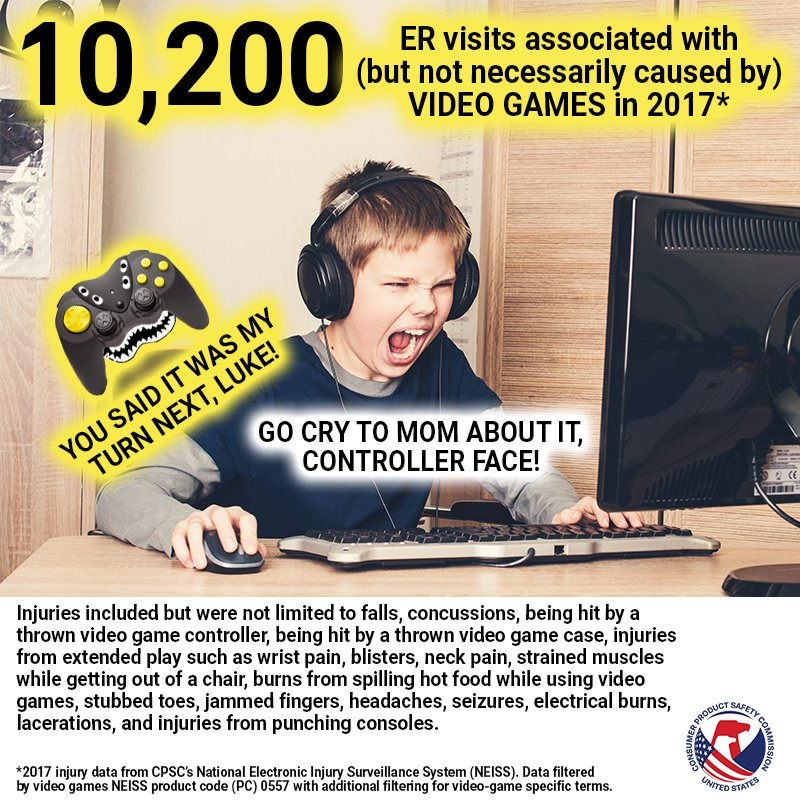
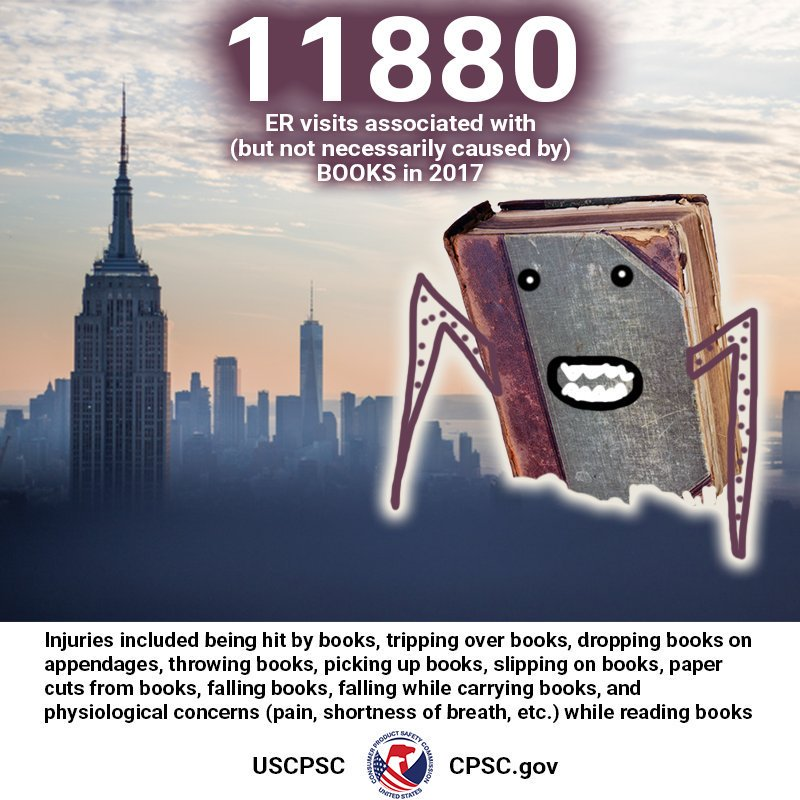
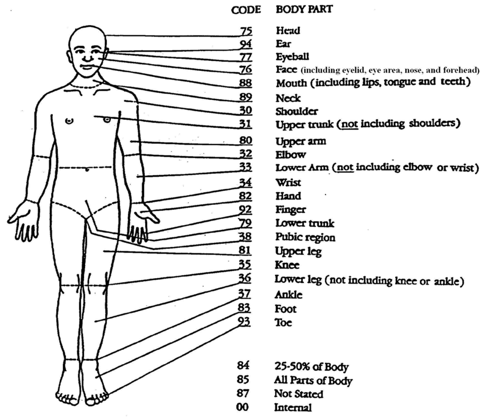

```{r setup, include=FALSE}
knitr::opts_chunk$set(echo = FALSE)
```

# Announcements

## R Workshop 

Ted is offering his R workshop today from 1:30 pm to 2:30 pm in Countway 424

## Problem Sets


# Data Visualization

## Recommended Reading for Lecture 7

- Chapter 1 and Chapter 5 in _R for Data Science_
- <http://ggplot2.tidyverse.org/reference/index.html>
- <https://plot.ly/ggplot2/>
- _[Streit & Gehlenborg (Nature Methods, 2014)](materials/streit-and-gehlenborg_nature-methods_2014.pdf)_ ([Journal Website](https://www.nature.com/nmeth/journal/v11/n2/full/nmeth.2807.html))
- _[Slides about data visualization fundamentals](materials/bmi-715_lecture-03.pdf)_

# Dataset

## National Electronic Injury Surveillance System (NEISS)

- Dataset produced by the United States Consumer Product Safety Commision
- Originally collection of consumer product-related injuries, since 2000 expanded to collect data on all injuries
- Collected at hospitals around the United States selected to represent as statistically valid sample of US population
- Data available from 1998 to 2017

## Video Games ...

```{r, out.width = "500px"}

```

## ... Books (Hold my beer!)

```{r, out.width = "500px"}

```

## Bodypart Diagram

```{r, out.width = "500px"}

```

## Preview

- __Lecture 7__
    - Learn how to visualize NEISS data
- __Lecture 8__
    - Compute common statistics on NEISS data
- __Lecture 10__ 
    - Cluster NEISS data to find patterns
- __Lecture 14__
    - Make a Shiny app to query and visualize NEISS data
  
## Group Exercise

1. Go to the NEISS website (Google is your best friend!)
1. Find the code book 
1. Look up some product codes that you find interesting
1. Create a ggplot that show the distribution of injuries caused by those products by month
1. Create a ggplot that show the distribution of injuries caused by those products by weekday
1. Stratify those distributions by sex

